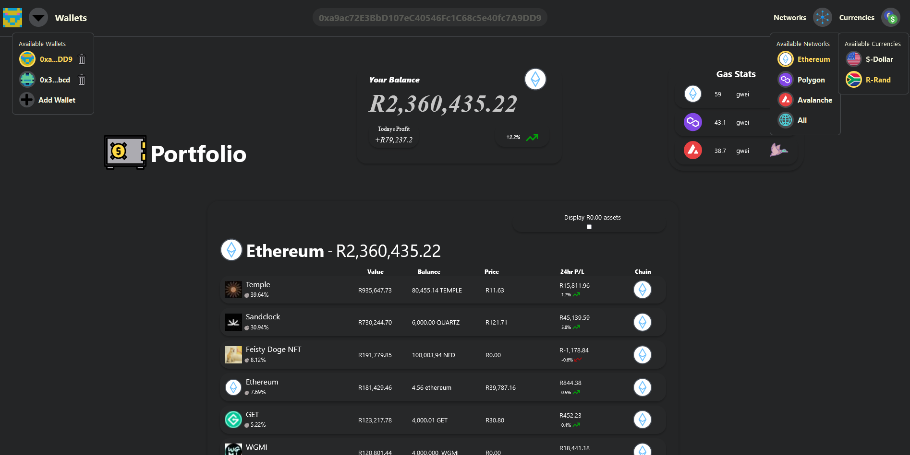

# Crypto Wallet Tracker

Gives the user a wallet portfolio view, by allowing them to view all their assets and respective values.

## Features

- Multiple wallet handling
- Metamask connectivity
- Currency Switching
- Chain switching
- Total value Display
- Combined chain display
- Spam Token display


## Example View



## Usage

```
yarn install
```

```
Create a .env file -> add required api keys:
REACT_APP_MORALIS_API_KEY=
REACT_APP_ETHERSCAN_API_KEY=
REACT_APP_POLYGONSCAN_API_KEY=
REACT_APP_SNOWTRACE_API_KEY=
REACT_APP_CURRENCY_API_KEY=
```

## Required API keys from providers:

### Token Balances for wallet


```
https://moralis.io/
```


### Prices of tokens in wallet


```
https://www.coingecko.com/
```


### Gas (gwei) cost per chain


```
https://etherscan.io/ - ETHEREUM
https://polygonscan.com/ - POLYGON
https://snowtrace.io - AVALANCHE
```

### Currency vs dollar values


```
https://freecurrencyapi.net
```
